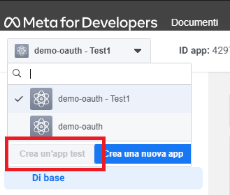

# Spike login Facebook e Google

Semplicissimo spike per eseguire il login con Google e Facebook

## Login Google

Seguire la seguente guida:

https://www.youtube.com/watch?v=GNKxGHVD1Eg&t=433s

**NOTA BENE**: modificare client-id e client-secret in application.properties 
utilizzando quelli fornitii sulla pagina dell'applicazione su Google Cloud Platform

---

## Login facebook

Leggermente più complicato. Seguire la seguente guida:

https://www.youtube.com/watch?v=nnsWiXBVeMI

Per fare accesso come Facebook Developer Account si richiede il numero di telefono.

**Problema**: creare l'applicazione non è sufficiente, siccome di default richiede
una connessione tramite HTTPS (che si può ottenere, ma ho voluto tagliare corto in questo
modo, tanto è sufficiente per i nostri scopi).

**Soluzione**:

Selezionare in alto a sinistra, come in foto, "Crea un'app test". Utilizzando client-id e client-secret di questa app
sarà possibile fare accesso senza HTTPS.

